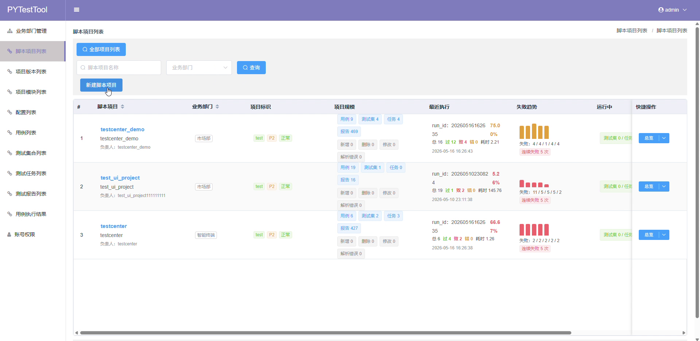
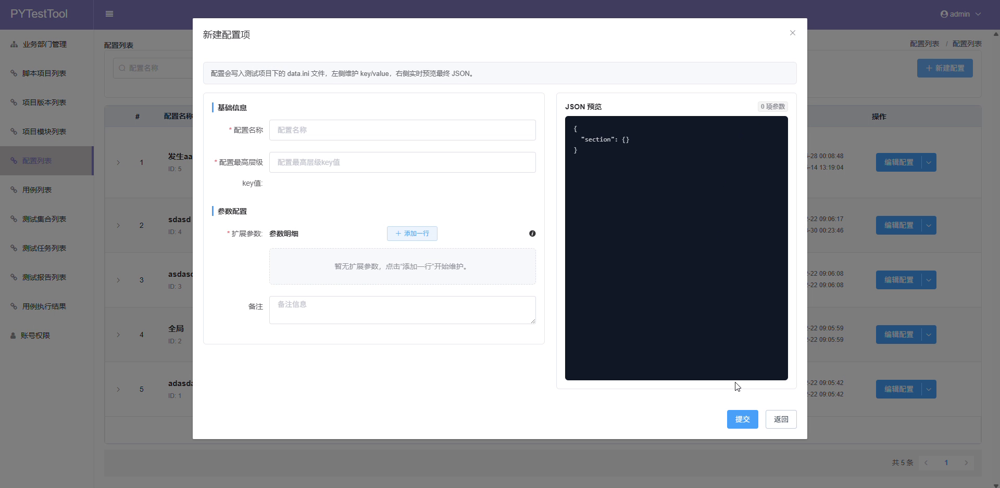
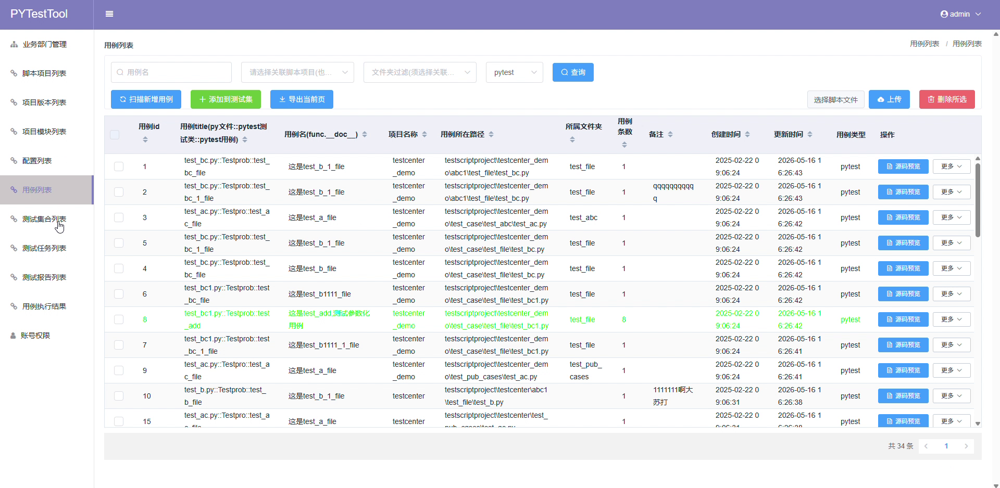
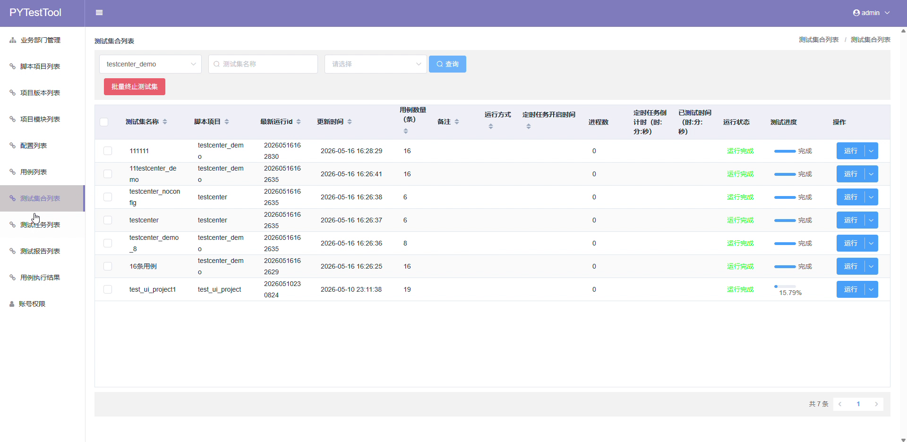
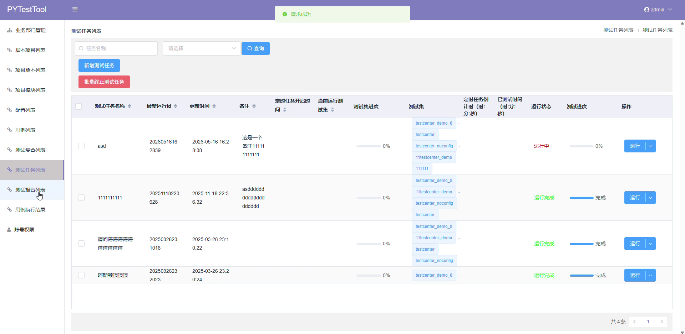
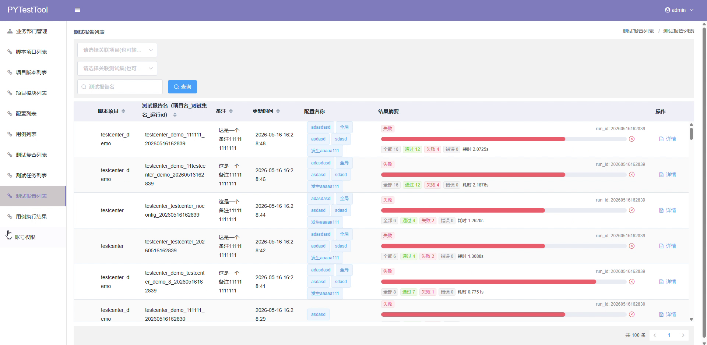
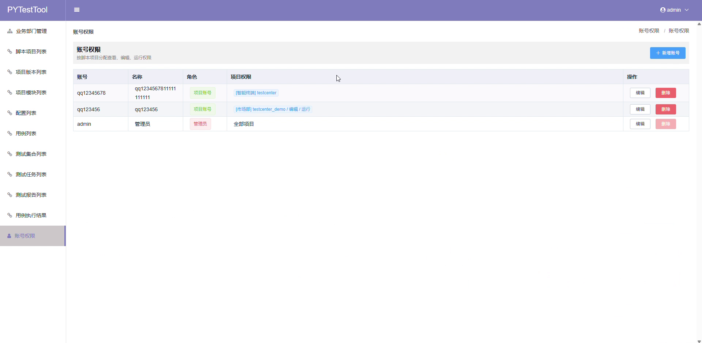

# PyTestTool Frontend

这是 PyTestTool 的前端项目，基于 Vue 2、Element UI、Webpack 2 构建，用于管理 pytest 自动化测试平台的脚本项目、业务部门、用例、测试集、测试任务、报告和账号权限。

## 环境要求

- Node.js 14.x
- npm 6.x

当前依赖链包含 `node-sass@4.14.1`，建议使用 Node.js 14.x。Node.js 18/20 可能会导致 `npm install` 失败。

## 安装依赖

```powershell
cd vue_pytest_tool
npm install
```

## 本地开发启动

```powershell
npm run dev
```

默认开发地址：

```text
http://127.0.0.1:8888
```

开发代理配置：

```text
config/index.js
```

默认代理到后端：

```text
http://127.0.0.1:5400
```

## 生产构建

```powershell
npm run build
```

构建产物输出到：

```text
dist/
```

当前构建过程中 `el-cascader-multi` 依赖会打印 UglifyJs 提示，但已验证 `npm run build` 退出码为 0。

## API 配置

前端 API 基础地址在：

```text
src/api/api.js
```

默认值：

```text
http://127.0.0.1:5400
```

部署到其他后端地址时，需要同步修改这里或改造成环境变量配置。

## 页面模块

- `src/views/pytestvue/department.vue`：业务部门管理
- `src/views/pytestvue/project.vue`：脚本项目列表、项目总览、文件预览、脚本同步
- `src/views/pytestvue/cases_new.vue`：用例列表
- `src/views/pytestvue/testset.vue`：测试集合列表
- `src/views/pytestvue/testtask.vue`：测试任务列表
- `src/views/pytestvue/report.vue`：测试报告列表
- `src/views/pytestvue/result.vue`：用例执行结果
- `src/views/pytestvue/config.vue`：配置列表
- `src/views/pytestvue/account.vue`：账号权限管理

路由和左侧菜单配置在：

```text
src/routes.js
```

## 页面截图

### 脚本项目列表



### 配置编辑



### 用例列表



### 测试集合列表



### 测试任务列表



### 测试报告列表



### 账号权限



## 登录与权限

登录后 token 存储在 `sessionStorage`，请求拦截器会把 token 放到 `Authorization` 请求头中。账号权限由后端接口校验，前端只负责菜单和页面展示。

默认管理员账号：

```text
用户名：admin
初始密码：123456789
```

## 注意事项

- 启动前请先启动后端服务。
- 后端默认端口是 `5400`，前端默认端口是 `8888`。
- `node_modules/` 和 `dist/` 不提交到仓库。
- 如果安装依赖失败，优先确认 Node.js 版本是否为 14.x。
